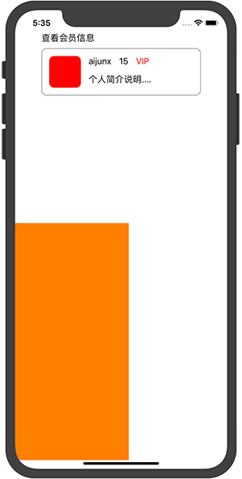

# AJLayoutKit
AJLayoutKit为iOS Auto Layout增加了一些语法糖, 使用接近VFL类似的语法，并且比较方便的使用百分比布局。语法糖参考了[Stevia](https://github.com/freshOS/Stevia)，并且做了一些改良。

- [x] **宽高父容器百分比**
- [x] **间距父容器百分比**
- [x] **Safe Area支持**
- [ ] 修改AJValue自动更新约束(暂时有bug)


# 导入
可以使用cocoapods导入。
```
platform :ios, '9.0'
use_frameworks!

target 'MyApp' do
	pod 'AJLayoutKit'
end
```

# 使用示例
```
	self.view.layout(
            |-(10% + 10)-title,
            |-(10% + 10)-panel-(10% + 10 ^ "right ratio span")-|,
            &-title-(10 ^ "title bottom")-panel,
            panel.layout(
                |-15-avatar.width(20%)-15-name-15-level-15-vip,
                &-15-avatar-15-&,
                &-15-name-15-desc,
                avatar.Width == avatar.Height,
                equal(.centerY, name, level, vip),
                equal(.leading, name, desc)
            ),
            ||v1.size(50% + 15)-(50% - 15)-|,
            &-(50% - 15)-v1.size(50% + 15)
        )
```
生成界面如下：

> 布局方式主要有三种：
> 1. 类似VFL的链式语法，|代表父容器以及水平方向布局，&代表父容器以及垂直方向布局，||表示水平布局，&&表示垂直布局，在iOS 11的版本上默认支持safe area。
> 2. 关联属性关系，类似于```avatar.Width == avatar.Height```，支持语法```attr1 == attr2*multiplier + constant ~ priority```。
> 3. 使用函数定义，比如UIView的size，width，height，或者是equal。


# AJValue
可以使用下面的语法来定义一个AJValue值，并且可以用于所有的间隙，宽高等内容，语法如下：
```
let v: AJValue = ratio% + constant ~ priority ^ "identifier"
```
同时也有三个函数来定义AJValue:
> 1. ```func vw(_ value: Double) -> AJValue```，类似CSS中的**vw**单位，效果相当于```screenWidth * value / 100```
> 2. ```func vh(_ value: Double) -> AJValue```，类似CSS中的**vh**单位，效果相当于```screenHeight * value / 100```
> 3. ```func rpx(_ value: Double) -> AJValue```，类似微信小程序或者是weex中单位，效果相当于```screenHeight * value / 750```


